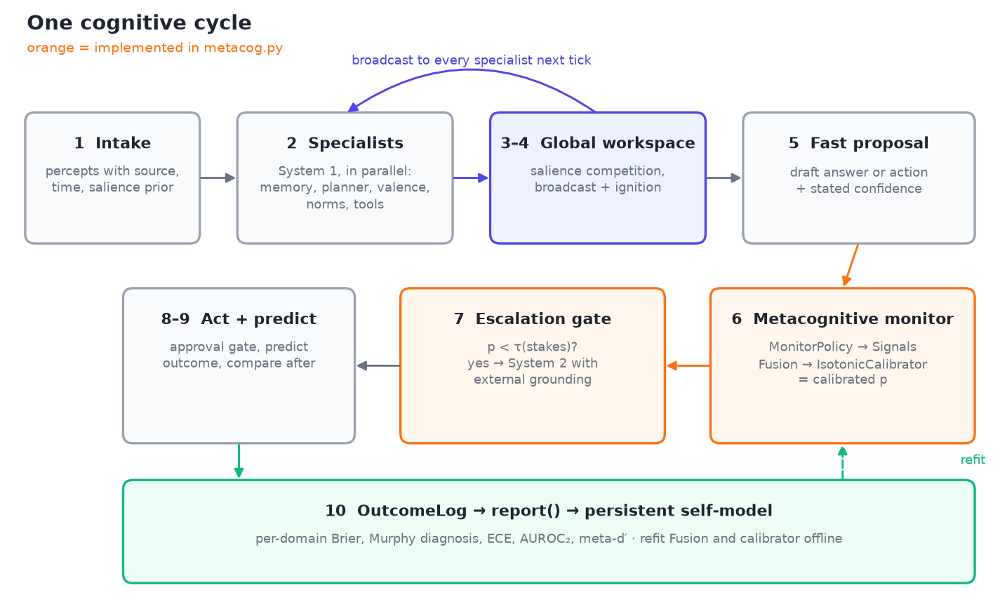

# Agent loop blueprint (v1, 2026-10-07)

## Design stance
Indicator-based and functional (Butlin et al. 2023): build and measure GWT, HOT, AST, PP and agency indicators. The goal is behaviour you can measure, not a claim of experience.

## One cognitive cycle (follows the CoALA decision loop)
1. **Intake.** User turns, tool results, sensors, schedule and event triggers become typed percepts: source, timestamp, salience prior.
2. **Specialists, run in parallel (System 1, GWT-1).** Episodic retriever (recency × importance × relevance, as in Generative Agents), core memory and user model (MemGPT tiers), planner, valence monitor (goal progress, user sentiment), norms and safety, tool-affordance proposer. Each one emits content, a salience score and a confidence.
3. **Workspace competition (GWT-2).** k slots, or a fixed token budget. Salience = w1·relevance + w2·goal urgency + w3·prediction error + w4·uncertainty − redundancy. The winners become working memory (as in CogniPair).
4. **Broadcast and ignition (GWT-3/4).** The winning contents go to every specialist for the next tick. Commit only when top salience passes a goal-dependent threshold; otherwise keep sampling.
5. **Fast proposal.** The generator drafts an answer or action, plus a stated confidence.
6. **Metacognitive monitor (HOT-2).** Combines semantic entropy over N samples, P(True), stated confidence and retrieval support into one calibrated p (isotonic fit on logged outcomes). The output is a higher-order belief: "claim X has reliability p".
   6b. **Attention schema (AST-1).** A short record of what is in the workspace and why, which the agent can query and report.
7. **Escalation gate (SwiftSage handoff).** If p < τ(stakes), or prediction error is high, hand off to System 2: ToT/LATS search plus external verification (tools, tests, retrieval of evidence that contradicts the draft, asking the user). Self-critique alone does not count as verification (Huang et al. 2024).
8. **Act behind an approval gate.** A separate Sentinel-style supervisor approves anything with side effects, with least privilege.
9. **Predict, then compare (PP-1, AE-1).** Record the predicted outcome before acting. Afterwards, prediction error feeds salience and belief updates. Choose between seeking information and acting by expected free energy, G = risk + ambiguity.
10. **Consolidate offline.** Reflexion-style lessons, Mem0-style add/update/delete, A-MEM linking, and an update to the self-model.

## Persistent self-model (readable and editable by the user)
Capability map with calibration per domain (Brier, ECE, M-ratio), active goals and commitments, user model, recent errors and their fixes, constitution and constraints.

## Evaluation harness
- **Type-1:** accuracy per domain.
- **Calibration:** Brier score as the primary metric (a proper scoring rule), plus ECE with 15 bins and a reliability diagram.
- **Sensitivity:** AUROC2. meta-d′ and M-ratio only on binary tasks (verifiable yes/no claims, predicting whether a tool call will succeed); they are not defined for open QA (Cacioli 2026).
- **Control:** escalation precision and recall, i.e. the share of errors the gate catches, and the cost per catch.
- **Belief revision:** inject contradicting evidence and compare the size of the update to the Bayesian ideal. Also log self-correction without feedback; expect about zero.
- **Communication:** the Steyvers calibration and discrimination gap measured with real users.

## Indicator coverage
- GWT-1 to 4: steps 2–4.
- HOT-2: step 6.
- HOT-3: steps 7 and 9; test with the Steinmetz Yalon protocol.
- AST-1: step 6b.
- PP-1: step 9.
- AE-1: steps 9 and 10.
- Partial: AE-2, through tools and sensors.
- Not addressed: RPT and HOT-4.

## Personal-agent parallels (Meta Muse, launched Sep 2026)
- Each user gets a cloud VM. The Sentinel supervisor plays the role of executive inhibition, sitting outside the workspace. Memory is file-based and editable by the user, which gives a transparent self-model. Scheduled and event triggers act as endogenous attention.
- Not published: a metacognitive or calibration layer. Sensing runs only in sessions the user starts.

## Build order
1. Memory tiers and outcome logging
2. Metacognitive monitor and calibration harness
3. Workspace competition
4. System 2 escalation
5. Prediction-error loop and self-model consolidation

## Risks
- Self-report diverges from internal state (Farquhar 2024; Xiong 2024).
- No self-correction without external grounding (Huang 2024).
- The limits of passive learning (Pezzulo 2024).
- Ethics: Butlin et al. see no obvious technical barrier to building systems that meet the indicators.
